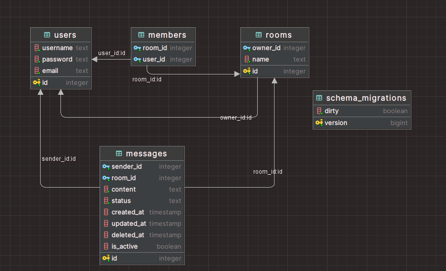

# Онлайн-чат с использованием WebSocket

## Описание

Разработайте бекенд для онлайн-чата, где пользователи могут обмениваться сообщениями в режиме реального времени. Используйте WebSocket или другой подходящий протокол для обмена сообщениями между клиентами.

## Функциональность

1. Несколько комнат для пользователей
2. Регистрация и авторизация
3. Обмен только сообщениями
4. Статус сообщения (просмотрено, отправлено)
5. Создать комнату и присоединиться к комнате
6. Переименовать комнату
7. Создать групповую комнату
8. Статистика
9. Поиск по пользователю
10. CRUD по пользователям
11. Пагинация для сообщений
12. Статус пользователя
13. Удалить историю сообщений чата
14. Блокировка пользователей

## Стек технологий

- Logrus: логирование
- Gin-gonic: веб-фреймворк
- nhooyr.io/websocket: библиотека WebSocket
- PostgreSQL: база данных

## Установка

1. Клонируйте репозиторий `git clone https://github.com/Specki-Sh/chat-server`
2. Откройте файл `configs/config.yml` и измените конфигурацию базы данных и порта на свои
3. Убедитесь, что переменная окружения `DB_PASSWORD` установлена и содержит пароль от базы данных
4. Запустите проект с помощью команды `go run cmd/main.go`

## Сборка

Чтобы собрать проект в исполняемый файл, выполните следующие шаги:

### Windows
1. Откройте терминал и перейдите в корневую директорию проекта
2. Выполните команду `go build -o chat.exe cmd/main.go`
3. Исполняемый файл `todolist.exe` будет создан в корневой директории проекта

### Linux и macOS
1. Откройте терминал и перейдите в корневую директорию проекта
2. Выполните команду `go build -o chat cmd/main.go`
3. Исполняемый файл `todolist` будет создан в корневой директории проекта

## Запуск

Чтобы запустить исполняемый файл после сборки, выполните следующие шаги:

### Windows
1. Откройте терминал и перейдите в директорию, где находится исполняемый файл
2. Выполните команду `chat.exe`

### Linux и macOS
1. Откройте терминал и перейдите в директорию, где находится исполняемый файл
2. Выполните команду `chmod +x chat` для предоставления прав на исполнение файла
3. Запустите исполняемый файл с помощью команды `./chat`

Проект запустится и будет доступен по указанному в конфигурации адресу и порту.

## Схема базы данных

## Порты

### Аутентификация

- `POST /auth/sign-up`: Регистрация нового пользователя
- `POST /auth/sign-in`: Вход пользователя в систему
- `GET /auth/logout`: Выход пользователя из системы

### Взаимодействие с комнатой

- `POST /rooms`: Создание новой комнаты (требуется аутентификация)
- `GET /rooms/:id/info`: Получение информации о комнате по ее ID
- `PATCH /rooms/:id/info`: Изменение информации о комнате по ее ID (требуется аутентификация и права владельца комнаты)
- `DELETE /rooms/:id`: Удаление комнаты по ее ID (требуется аутентификация и права владельца комнаты)
- `POST /rooms/:id/members/:userID`: Добавление пользователя в комнату (требуется аутентификация и права владельца комнаты)
- `DELETE /rooms/:id/messages`: Удаление всех сообщений из комнаты (требуется аутентификация и права владельца комнаты)

### Чат

- `GET /chat/joinRoom/:id`: Присоединение к комнате чата по ее ID

### Сообщения

- `GET /messages/paginate/rooms/:roomID`: Получение сообщений из комнаты с пагинацией (требуется аутентификация и доступ к комнате)
- `PATCH /messages/:id`: Изменение сообщения по его ID (требуется аутентификация и быть создателем сообщения)
- `DELETE /messages/:id`: Удаление сообщения по его ID (требуется аутентификация и быть создателем сообщения)
